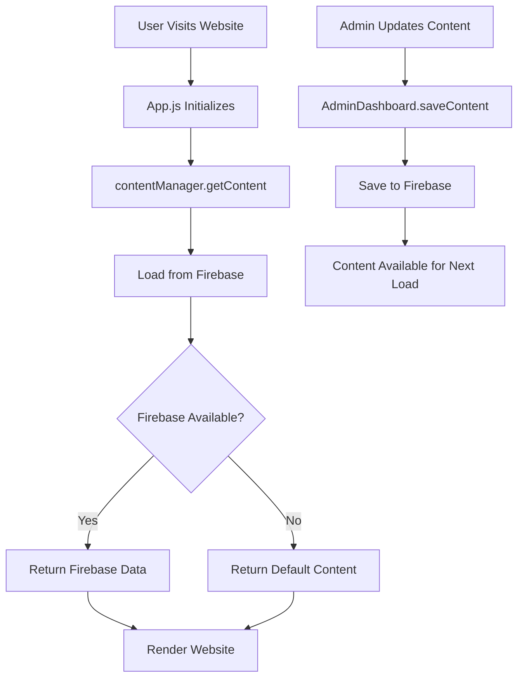

# Design Document: Persistent Content Storage

## Overview

This design addresses the critical disconnect between the admin dashboard (which saves to Firebase) and the public website (which loads from localStorage). The solution involves refactoring the `contentManager.js` module to load all dynamic content from Firebase instead of localStorage, ensuring content consistency across all browsers and sessions.

The key insight is that the infrastructure is already in place - Firebase is configured and the admin panel successfully saves to it. We simply need to update the content loading mechanism to match the saving mechanism.

## Architecture

### Current Architecture (Problematic)

```
Admin Dashboard → Firebase (save)
Public Website → localStorage (load) ❌
```

This creates a data flow mismatch where saves and loads use different storage mechanisms.

### New Architecture (Solution)

```
Admin Dashboard → Firebase (save)
Public Website → Firebase (load) ✓
```

Both components will use Firebase as the single source of truth.

### Component Interaction



## Components and Interfaces

### 1. Content Manager Module (`contentManager.js`)

**Current Responsibilities:**
- Load content from localStorage
- Provide content to React components
- Return default content as fallback

**New Responsibilities:**
- Load content from Firebase asynchronously
- Cache content in memory for the session
- Provide content to React components
- Return default content as fallback when Firebase is unavailable

**Key Functions to Modify:**

#### `loadDynamicContent()` - REMOVE
This function currently loads from localStorage and will be removed entirely.

#### `getContent(language)` - REFACTOR
This function will be converted to an async function that loads from Firebase.

**New Function Signature:**
```javascript
export const getContent = async (language) => {
  // Load from Firebase instead of localStorage
  const dynamic = await loadDynamicContentFromFirebase();
  
  // Rest of the logic remains the same
  // Return content structure for the specified language
}
```

#### `loadDynamicContentFromFirebase()` - NEW
A new async function that loads all content types from Firebase.

**Function Signature:**
```javascript
const loadDynamicContentFromFirebase = async () => {
  // Fetch all content types from Firebase in parallel
  // Return structured content object
  // Handle errors and return defaults on failure
}
```

### 2. Firebase Helpers Module (`firebaseHelpers.js`)

**Current State:** Already has `getContent()` and `saveContent()` functions that work correctly.

**Required Changes:** None - this module is already correctly implemented.

**Interface:**
```javascript
// Fetch content by type
export const getContent = async (contentType) => {
  // Returns: content object or null
}

// Save content by type
export const saveContent = async (contentType, data) => {
  // Returns: boolean success status
}
```

### 3. React Components

**Components Affected:**
- `Home.js` - Uses hero content, about info, services
- `Careers.js` - Uses careers data
- `Services.js` - Uses services data
- `Partners.js` - Uses partners data
- `Contact.js` - May use contact info
- `App.js` - Initializes content loading

**Required Changes:**
All components that call `getContent()` must handle the async nature of the new implementation.

**Migration Pattern:**
```javascript
// OLD (synchronous)
const content = getContent(language);

// NEW (asynchronous)
const [content, setContent] = useState(null);
const [loading, setLoading] = useState(true);

useEffect(() => {
  const loadContent = async () => {
    const data = await getContent(language);
    setContent(data);
    setLoading(false);
  };
  loadContent();
}, [language]);
```

## Data Models

### Content Structure

The existing data structure will be preserved to maintain compatibility:

```javascript
{
  careers: [
    {
      id: number,
      titleEn: string,
      titleAr: string,
      type: string,
      typeAr: string,
      descEn: string,
      descAr: string
    }
  ],
  aboutInfo: {
    descEn: string,
    descAr: string,
    founded: string,
    team: string,
    type: string,
    typeAr: string
  },
  services: [
    {
      id: number,
      titleEn: string,
      titleAr: string,
      descEn: string,
      descAr: string,
      imageUrl: string
    }
  ],
  heroContent: {
    titleEn: string,
    titleAr: string,
    subtitleEn: string,
    subtitleAr: string
  },
  partners: [
    {
      id: number,
      nameEn: string,
      nameAr: string,
      logoPath: string,
      order: number
    }
  ]
}
```

### Firebase Document Structure

Content is stored in the `content` collection with documents for each content type:

```
content/
  ├── careers { jobs: [...] }
  ├── aboutInfo { descEn, descAr, ... }
  ├── services { services: [...] }
  ├── heroContent { titleEn, titleAr, ... }
  └── partners { partners: [...] }
```

### Default Content

Default content will be maintained as constants within `contentManager.js` to serve as fallbacks when Firebase is unavailable.


## Correctness Properties

A property is a characteristic or behavior that should hold true across all valid executions of a system - essentially, a formal statement about what the system should do. Properties serve as the bridge between human-readable specifications and machine-verifiable correctness guarantees.

### Property 1: Firebase Content Loading

*For any* content type (careers, services, partners, aboutInfo, heroContent), when the Content_Manager loads content, it should fetch that content from Firebase using the getContent function from firebaseHelpers.

**Validates: Requirements 1.1, 1.4**

### Property 2: Fallback to Defaults with Error Logging

*For any* Firebase error (connection failure, timeout, network error), when the Content_Manager attempts to load content, it should return default content and log an error message to the console.

**Validates: Requirements 1.2, 4.1, 4.2**

### Property 3: No localStorage Usage

*For any* content loading operation, when Firebase is available and returns valid data, the Content_Manager should not access localStorage for reading dynamic content.

**Validates: Requirements 1.3**

### Property 4: Content Updates Are Retrievable

*For any* content update saved to Firebase, when the Content_Manager subsequently loads that content type, it should retrieve the updated content.

**Validates: Requirements 2.3**

### Property 5: Data Structure Compatibility

*For any* content loaded from Firebase, the returned data structure should match the expected format with all required fields (careers array, services array, aboutInfo object, heroContent object, partners array).

**Validates: Requirements 3.3**

### Property 6: Graceful Timeout Handling

*For any* network timeout when loading from Firebase, the Content_Manager should handle the timeout gracefully by returning default content without throwing unhandled exceptions.

**Validates: Requirements 4.3**

### Property 7: Invalid Data Handling

*For any* invalid or empty data returned from Firebase (null, undefined, empty object, malformed data), the Content_Manager should use default content values for the affected content type.

**Validates: Requirements 4.4**

### Property 8: Content Caching

*For any* content type, when the Content_Manager loads content multiple times within the same session, it should only fetch from Firebase once and return cached data for subsequent requests.

**Validates: Requirements 5.1**

### Property 9: Parallel Loading

*For all* content types, when the Content_Manager initializes and loads all content, it should initiate all Firebase fetch operations in parallel rather than sequentially.

**Validates: Requirements 5.4**

### Property 10: Save-Load Round Trip

*For any* content object, when saved to Firebase through the Admin_Dashboard and then immediately loaded through the Content_Manager, the loaded content should match the saved content.

**Validates: Requirements 6.4**

## Error Handling

### Firebase Connection Errors

**Scenario:** Firebase is unavailable or returns an error

**Handling:**
1. Log error to console with descriptive message
2. Return default content for the requested type
3. Display console warning about Firebase unavailability
4. Continue normal operation with defaults

**Implementation:**
```javascript
try {
  const data = await getContent(contentType);
  if (!data) {
    console.warn(`Firebase returned no data for ${contentType}, using defaults`);
    return getDefaultContent(contentType);
  }
  return data;
} catch (error) {
  console.error(`Firebase error loading ${contentType}:`, error);
  console.warn(`Using default content for ${contentType}`);
  return getDefaultContent(contentType);
}
```

### Invalid Data Errors

**Scenario:** Firebase returns data in an unexpected format

**Handling:**
1. Validate data structure before using
2. If invalid, log warning and use defaults
3. Partial data: merge with defaults to fill gaps

**Implementation:**
```javascript
const validateContent = (data, contentType) => {
  if (!data || typeof data !== 'object') return false;
  
  // Type-specific validation
  switch(contentType) {
    case 'careers':
      return Array.isArray(data.jobs);
    case 'services':
      return Array.isArray(data.services);
    // ... other validations
  }
  return true;
};
```

### Network Timeout Errors

**Scenario:** Firebase request times out

**Handling:**
1. Catch timeout exception
2. Log timeout error
3. Return default content
4. Do not retry automatically (avoid cascading delays)

### Caching Errors

**Scenario:** Cached data becomes stale or corrupted

**Handling:**
1. Implement cache invalidation on page refresh
2. Store cache with timestamp
3. Clear cache if older than session
4. No persistent cache across sessions

## Testing Strategy

### Unit Tests

Unit tests will verify specific examples and edge cases:

1. **Firebase Integration Tests**
   - Test successful content loading from Firebase
   - Test each content type individually
   - Verify correct data transformation

2. **Error Handling Tests**
   - Test Firebase connection failure
   - Test timeout scenarios
   - Test invalid data formats
   - Test null/undefined responses

3. **Default Content Tests**
   - Verify default content structure
   - Test fallback for each content type
   - Ensure defaults match expected schema

4. **Component Integration Tests**
   - Test React components with async content loading
   - Verify loading states
   - Test error states in UI

### Property-Based Tests

Property-based tests will verify universal properties across all inputs using a JavaScript property-based testing library (fast-check). Each test will run a minimum of 100 iterations.

1. **Property 1: Firebase Content Loading**
   - Generate random content types
   - Mock Firebase responses
   - Verify Firebase is called for each type
   - **Tag: Feature: persistent-content-storage, Property 1: Firebase Content Loading**

2. **Property 2: Fallback to Defaults with Error Logging**
   - Generate random Firebase errors
   - Verify default content is returned
   - Verify console.error and console.warn are called
   - **Tag: Feature: persistent-content-storage, Property 2: Fallback to Defaults with Error Logging**

3. **Property 3: No localStorage Usage**
   - Mock localStorage
   - Generate random content loads
   - Verify localStorage.getItem is never called
   - **Tag: Feature: persistent-content-storage, Property 3: No localStorage Usage**

4. **Property 4: Content Updates Are Retrievable**
   - Generate random content updates
   - Save to Firebase
   - Load from Content_Manager
   - Verify loaded content matches saved content
   - **Tag: Feature: persistent-content-storage, Property 4: Content Updates Are Retrievable**

5. **Property 5: Data Structure Compatibility**
   - Generate random Firebase responses
   - Load content
   - Verify structure matches expected schema
   - **Tag: Feature: persistent-content-storage, Property 5: Data Structure Compatibility**

6. **Property 6: Graceful Timeout Handling**
   - Simulate random timeout scenarios
   - Verify no unhandled exceptions
   - Verify default content is returned
   - **Tag: Feature: persistent-content-storage, Property 6: Graceful Timeout Handling**

7. **Property 7: Invalid Data Handling**
   - Generate random invalid data (null, undefined, empty, malformed)
   - Verify defaults are used
   - Verify no crashes
   - **Tag: Feature: persistent-content-storage, Property 7: Invalid Data Handling**

8. **Property 8: Content Caching**
   - Load content multiple times
   - Verify Firebase is called only once
   - Verify subsequent calls return cached data
   - **Tag: Feature: persistent-content-storage, Property 8: Content Caching**

9. **Property 9: Parallel Loading**
   - Mock Firebase with delays
   - Load all content types
   - Verify all requests start before any complete
   - **Tag: Feature: persistent-content-storage, Property 9: Parallel Loading**

10. **Property 10: Save-Load Round Trip**
    - Generate random content objects
    - Save through Admin_Dashboard
    - Load through Content_Manager
    - Verify equality
    - **Tag: Feature: persistent-content-storage, Property 10: Save-Load Round Trip**

### Testing Library

We will use **fast-check** for property-based testing in JavaScript/React:

```bash
npm install --save-dev fast-check
```

### Test Configuration

- Minimum 100 iterations per property test
- Use Jest as the test runner
- Mock Firebase using Jest mocks
- Mock console methods to verify logging

### Integration Testing

1. **End-to-End Flow**
   - Admin saves content → Public site loads content
   - Verify cross-browser consistency
   - Test with real Firebase (staging environment)

2. **Performance Testing**
   - Measure content load times
   - Verify caching reduces load time
   - Test with large content datasets

3. **Regression Testing**
   - Verify all existing pages still render correctly
   - Test language switching
   - Verify all content sections display properly
